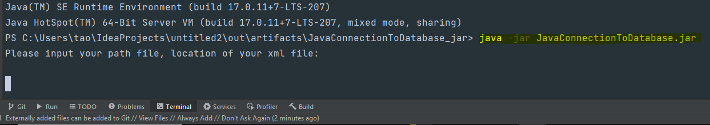
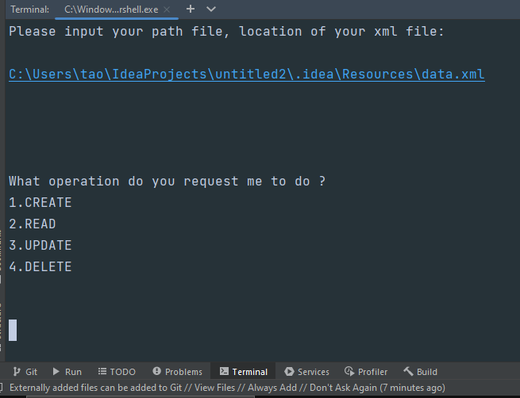
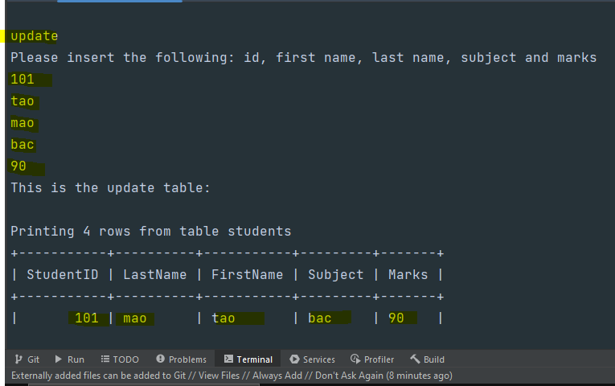

# JavaConnectionToDatabase - gets xml data and creates table of it in database

### Mockup of retrieving Data (work in progress)
https://github.com/user-attachments/assets/a2a88bd5-b39b-417b-980e-1719f3076ee0
[//]: # (<video src='video1.mov' width=180/> | <video src='video2.mp4' width=180/>)
 <video align="left" width="300" src="src/resources/test_vid.mp4" alt="cmd video" />

 

 

 

